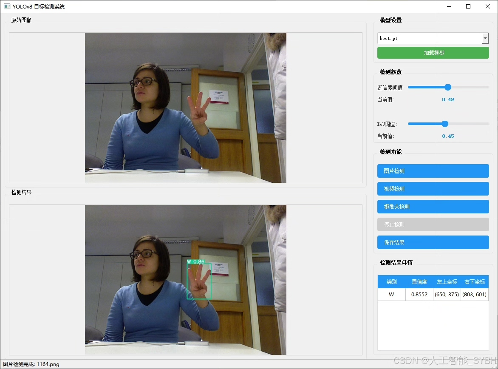
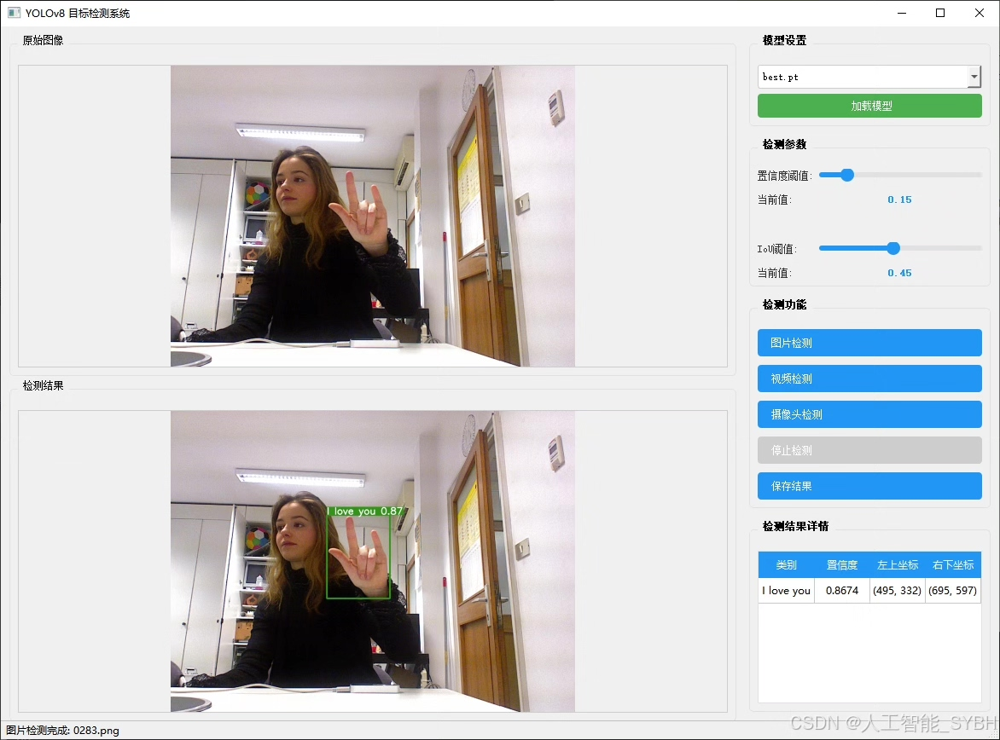
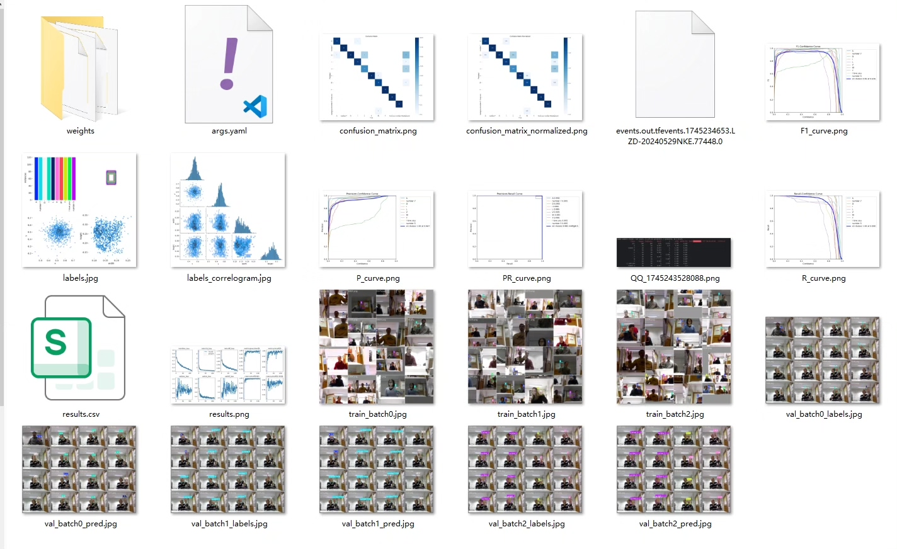
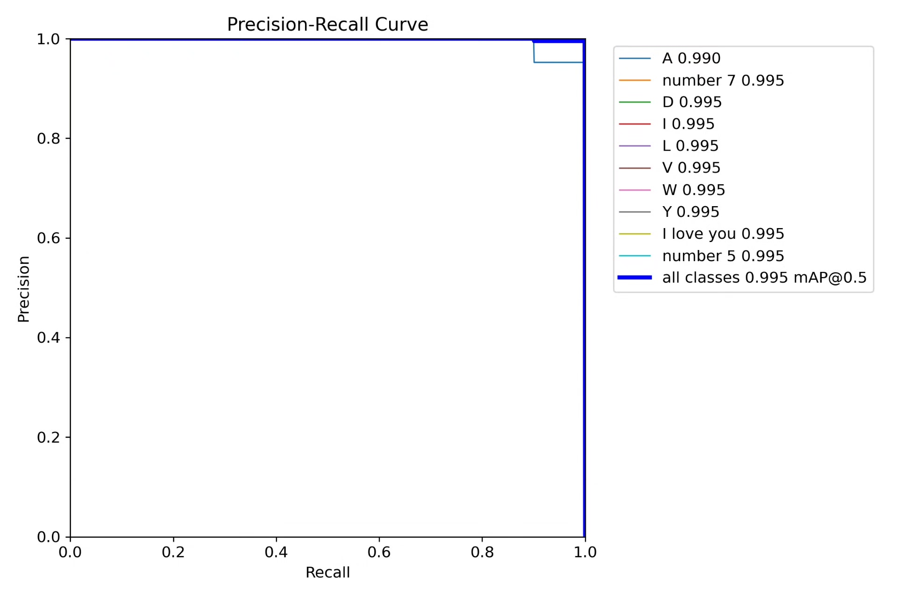
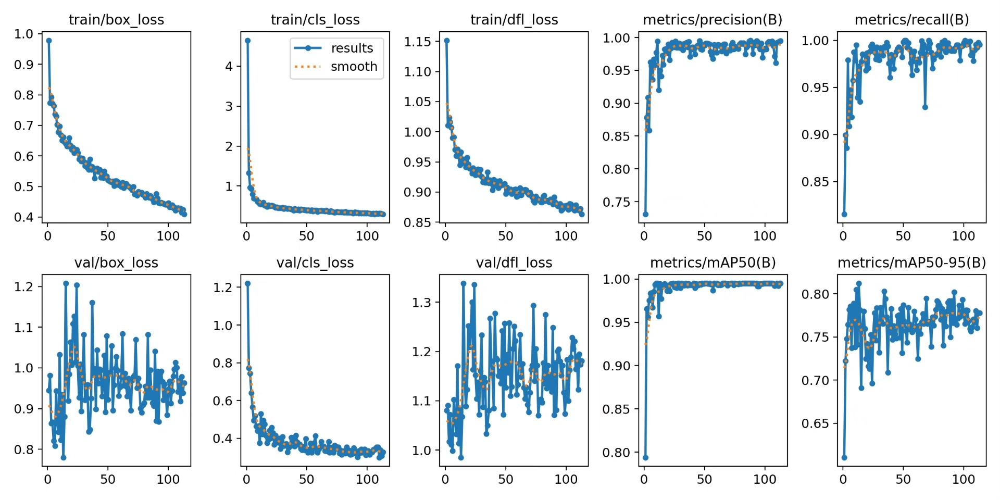
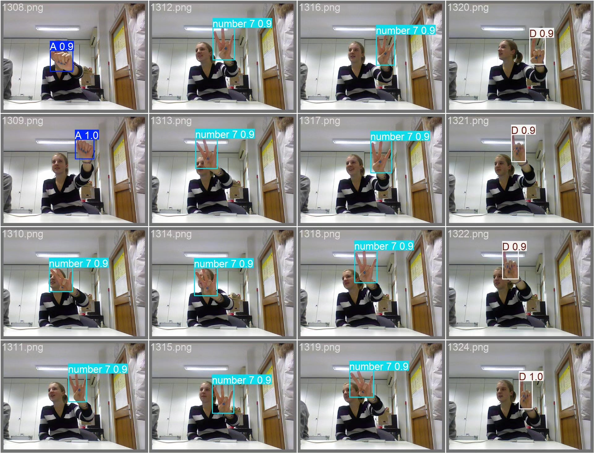
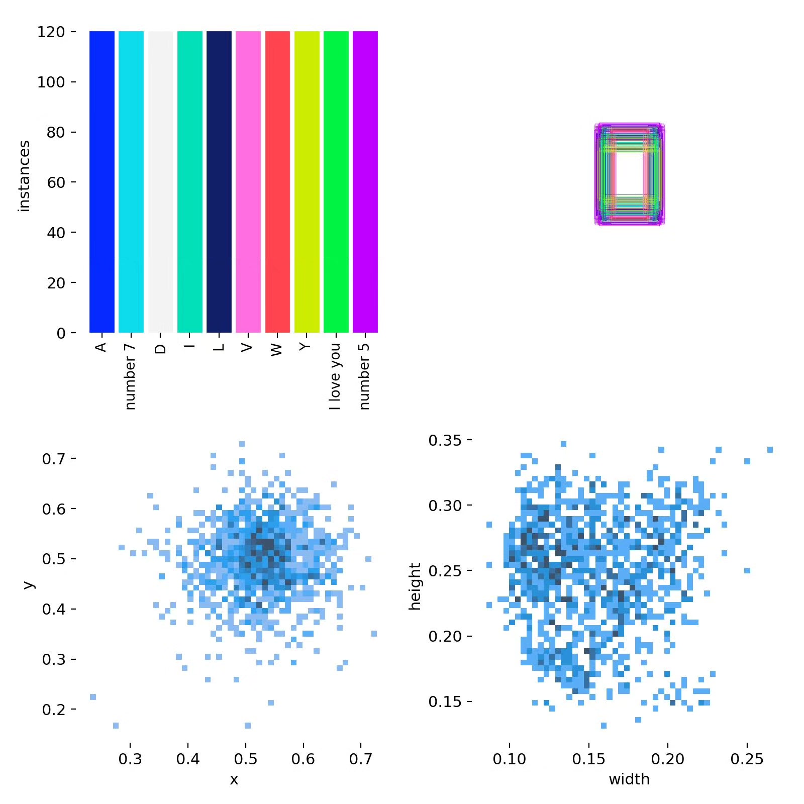
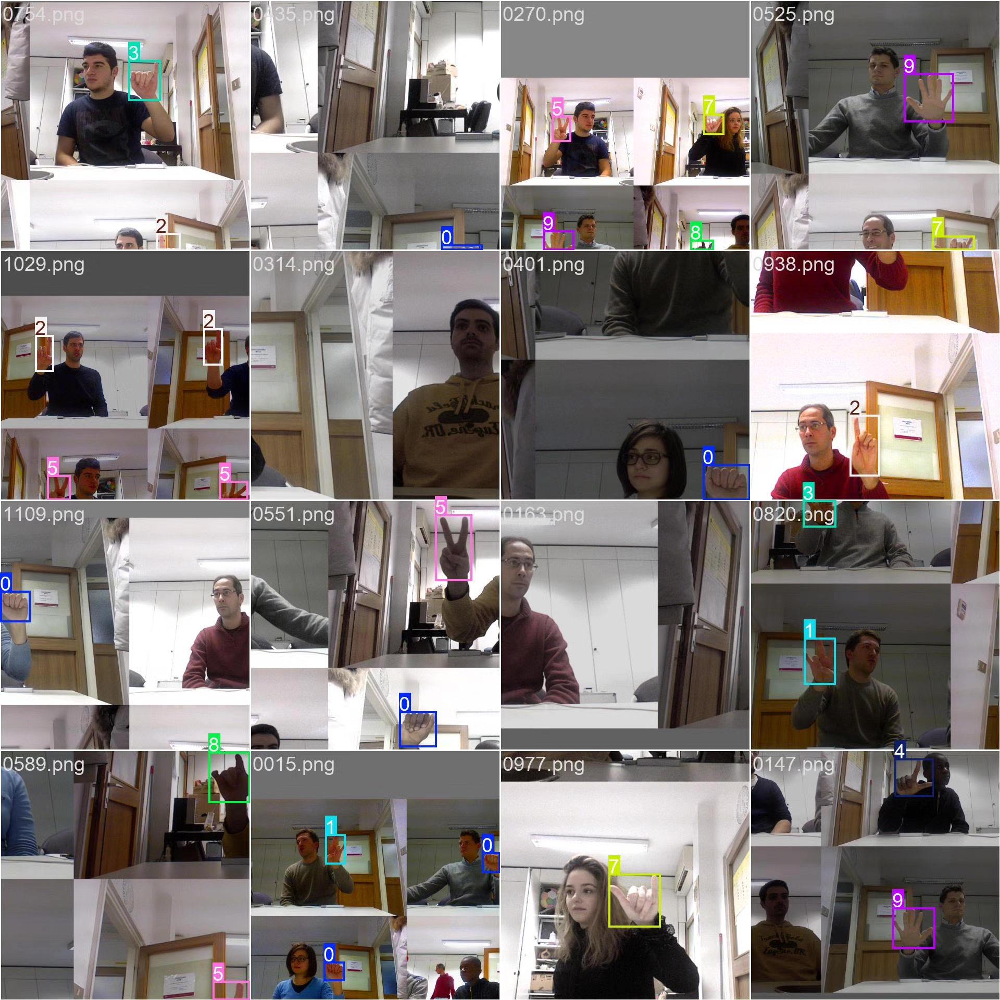

# Gesture Recognition Detection System Based on YOLOv8 Deep Learning (YOLOv8+Y)

## Body

This project is based on the advanced YOLOv8 deep learning algorithm to develop a high-efficiency and precise real-time gesture recognition detection system. The system can accurately recognize 10 common gestures, including letter gestures (A, D, I, L, V, W, Y), number gestures (5, 7), and special gestures (I love you). The project uses a dataset of 1400 gesture images (1200 training set, 200 validation set) through data enhancement, transfer learning, model optimization, and other technical means, which significantly improves the accuracy and robustness of gesture recognition in complex scenarios.

The company's products have obtained the official commercial license certification from YOLO.

We provide after-sales service.

After payment, we will provide WeChat ID for any questions.

Environment configuration: We will provide an environment configuration tutorial, and WeChat will provide answers.

Remote installation service: If you need remote configuration, an additional fee of 69 is required,
If the configuration fails, all fees will be refunded (specially for old computers only refund installation fees)

Retraining dataset: After configuring the environment, you can train on your own computer.
If you need us to retrain, just pay 69 + computing power fees (2.5 yuan/hour)

Full after-sales service

## Images

## Payment

Here is a pay link on Stripe ( https://buy.stripe.com/3cs8yP7sY87d0vu9AB ). Please contact me lonlonago@foxmail.com after funding $89, and I will send you a complete data files , thank you!

